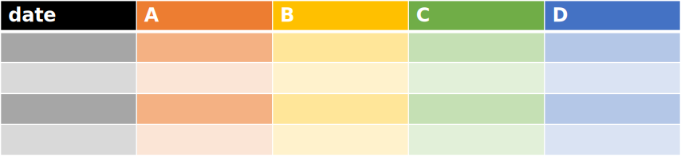
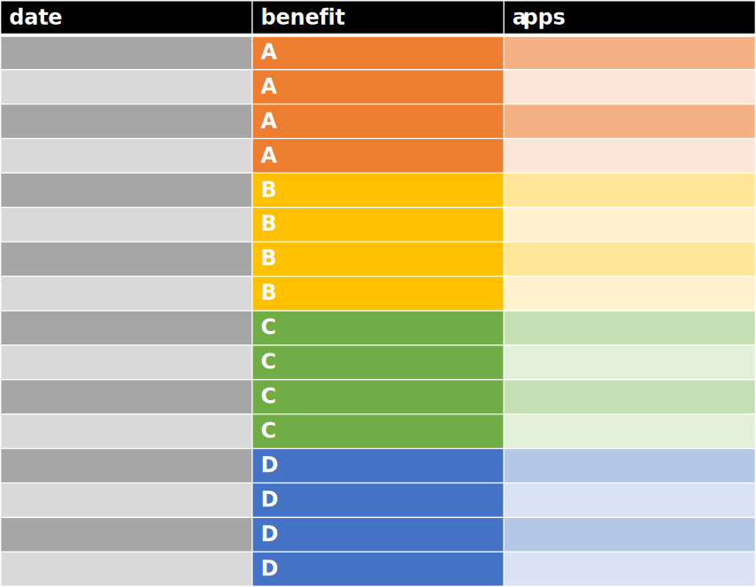

```{r setup, include=FALSE}
knitr::opts_chunk$set(echo = TRUE, eval = TRUE, warning = FALSE, message = FALSE)
```

In this session, we will analyse a mock dataset. 

Social Security Scotland administers four benefits: Benefit A - Benefit D. You have collected data summarising the monthly applications for each of these benefits between January 2020 and January 2025.

You need to:
  
  1. Import and explore the data
  2. Plot the data over time for each of the benefits as well as the total
  3. Plot a bar graph with error bars to compare the mean number of applications for the four benefits

```{r LoadandSource}

library(tidyverse)
# Call an external file. This file creates the data. We will look at it at the end of the session
source("./R/create_data.R") 

```

# Import and explore the data

We import the data to create a tibble called benefits. We view the first few lines to see what the data is that is included

```{r ImportAndExplore}

benefits <- read_csv("./benefits.csv")

# view the first few lines of the tibble
head(benefits)


```

## Data exploration

First, we look at the structure of benefits. Recall the function str()

```{r Explore1}

str(benefits)


```

Next, get the summary statistics

```{r Explore2}

summary(benefits)

```

Are there any points that are indicative of errors in data capture?

It is good practice to look if there are any missing values in the data. The function is.na() will tell you if there are any missing data.

```{r Explore3}

is.na(benefits)

```


How can we get the total number of missing values in the dataset?
```{r Explore4}

sum(is.na(benefits))

```

If you want to return the index of datapoints with missing data, you can use the function which()


## Exploratory plots

Now we can create quick exploratory plots of the data. Look at the help function for plot()

```{r QuickPlot}

plot(benefits$date, benefits$A)
plot(benefits$date, benefits$B)
plot(benefits$date, benefits$C)
plot(benefits$date, benefits$D)


```


# Wrangling and plotting the applications numbers over time


R has powerful (and pretty plotting) functionality in the library ggplot2, which is part of the tidyverse environment. All of tidyverse uses long data. In long format, each row corresponds to data from one measurement, and repeated measurements are on different rows. 

We need to get the data in the correct structure. Tidyverse has two functions for reshaping datasets, pivot_wider() and pivot_longer().
pivot_longer() transforms a dataset so that it is has more rows and fewer columns, e.g. with one measurement per row, whilst pivot_wider() transforms a dataset so that it has more columns and fewer rows e.g. one row per observation.

(Note, pivot_longer and a related function, pivot_wider, became available in a relatively recent version of R. Older code may use gather() and spread())

## Data wrangling

Our dataset is currently in wide format, with the number of applications for each benefit in different columns.



We want to reshape our data to long format, with a variable called "benefit" specifying the benefit, and one called "apps" for the number of applications.




As we want to reshape the dataset to have fewer columns and more rows, we will use the pivot_longer() function. See the help section
for all the options available for pivot_longer()

pivot_longer() and pivot_wider() are powerful functions that can reshape datasets in a variety of ways. 
For pivoting longer we need to provide the dataset, and the columns we want to pivot to a long format. The
remaining parameters are all optional and are used to tell R how we want the reshaping to be done.

Typically the two additional parameters used are names_to and values_to which specify the variables containing
the pivoted variables names and values respectively.

In our case we want to:

* use the benefits dataset
* pivot the columns A, B, C and D
* add a column 'benefit' containing the name of the benefit
* add a column 'apps' containing the values of the number of applications, for each benefit


```{r WideToLong}


benefit_long <- pivot_longer(benefits, 
                             cols = -date, 
                             names_to = "benefit", 
                             values_to = "apps")
head(benefit_long)

```

To get the total applications for each month, we need to use group_by() and summarise() from the package dplyr which is part of the tidyverse suite.

Once we summarise, we can add this to our benefit_long dataframe. We need to specify the benefit, and here we use the label "Total"


```{r AddTotal}

benefit_total <- benefit_long %>%
  group_by(date) %>%
  summarise(apps = sum(apps), 
            benefit = "Total") %>%
  ungroup()

head(benefit_total)

#Now append benefit_total to benefit_long

benefit_long <- bind_rows(benefit_long, benefit_total)

```


## Plotting
The syntax for ggplot has the following elements:

  1. create a ggplot object which is defined by the dataset, and the aesthetic (including the variables). 
  2. Specify geometries (i.e. plot types). Geometries such as plotting points, lines and bars are available. The specification of geometries enables one to plot various plot types on the same set of axes. See help(package = ggplot2) under the letter g for the various geometries available. 
  3. Customise the appearance. Colours, background, labels etc. (optional)
  
Here, we will plot the data with a point geometry
  
```{r TimeSeriesPlot1}
time_series_plot <- ggplot(data = benefit_long,
                           aes(x=date, y = apps)) +
            #Add the geometry
                             geom_point()
                            
#call the object to show the plot
time_series_plot


```

This has combined the data for all the benefits. We can separate these by colour by using the aesthetic to specify the grouping variable


```{r}
time_series_plot2 <-  ggplot(data = benefit_long,
                           aes(x=date,
                               y = apps,  
                               group = benefit, 
                               colour = benefit)) +
  geom_point()

time_series_plot2
  
```

This is getting a bit cluttered, so let's separate these into panels

```{r TimeSeriesPlot3}

time_series_plot3 <- time_series_plot2 + 
  facet_grid(rows = vars(benefit))
time_series_plot3

```


Now that we can see the plots, let's fit lines, to the points, and a straigh line for the trend

```{r TimeSeriesPlot4}

time_series_plot4 <- time_series_plot3 + 
  geom_line() +
  geom_smooth(method = "lm")  #Uses a linear model for fit and confidence interval

time_series_plot4

```


Finally, let's change the axes labels, legend title and background using themes.
Themes allow us to customize the appearance. ggplot comes with several themes
such as theme_bw(), or you can create your own themes. For examples see the
Scottish Government theme [sgplot](https://github.com/DataScienceScotland/sgplot), 
or the [NRS theme](https://github.com/DataScienceScotland/nrsplot)

```{r TimeSeriesPlot5}

time_series_plot5 <- time_series_plot4 +
  xlab("Date") +
  ylab("Application number") +
  labs(colour = "Benefit") +
  theme_bw()

time_series_plot5

```

Finally, we could perform the wrangling and plotting  in a concise chunk

```{r AllAnalysis}
#Import
benefits <- read_csv("./benefits.csv")

#Wide to long
benefit_long <- pivot_longer(benefits, 
                             cols = !date, 
                             names_to = "benefit", 
                             values_to = "apps")
#Get total
benefit_total <- benefit_long %>%
  group_by(date) %>%
  summarise(apps = sum(apps), 
            benefit = "Total") %>%
  ungroup()

#Append benefit_total to benefit_long
benefit_long <- benefit_long %>%
  bind_rows(benefit_total)


#Plotting
time_series_plot <-  ggplot(data = benefit_long,
                           aes(x=date,
                               y = apps,  
                               group = benefit, 
                               colour = benefit)) +
  geom_point() + 
  facet_grid(rows = vars(benefit)) +
  geom_line() +
  geom_smooth(method = "lm") +  
  xlab("Date") +
  ylab("Application number") +
  labs(colour = "Benefit") +
  theme_bw()

time_series_plot

  


```


# Plotting the mean applications per year as a bar graph

To take the average  by year, we need to create a factor variable for the year which we can use for grouping. The lubridate package has a convenient function year(). We will need to mutate benefit_long to append this factor variable

## Wrangling

```{r CreateYearIndicator}
library(lubridate)

benefit_long <- benefit_long %>%
  mutate(year = year(date)) %>%
  mutate(year = as.factor(year))  #These two lines could be combined: mutate(year = as.factor(year(date)))


```

Now we group the data and summarise. The summary statistics that we will evaluate are the +- sd which will be used as error bars. We only want the yearly averages by benefit, so we will (un)select "Total"

```{r SummariseByYear}

benefit_by_year <- benefit_long %>%
  filter(benefit != "Total") %>%
  group_by(year, benefit) %>%
  summarise(average_apps = mean(apps), 
            error_bar_min = average_apps - sd(apps), 
            error_bar_max = average_apps + sd(apps)
            )

head(benefit_by_year)


```


## Plotting bar graph

Now we create a ggplot object. The x-axis will show the year, and will use colour for the benefit.

We will apply the geom_col and geom_errorbar geometries. Note that geom_col by default plots a stacked bar graph. To unstack the graph you will need to use the function dodge <- position_dodge(...) and then the argument "position = dodge" needs to be passed to the geometries.

We will remove the label from the x-axis and change the labels for the y-axis to "Average yearly applications"

```{r BarGraph}

bar_graph_plot <- ggplot(data = benefit_by_year, 
                         aes(x = year,
                             y = average_apps, 
                             colour = benefit, 
                             group = benefit
                             )) 

dodge <- position_dodge(width=0.9)

bar_graph_plot <- bar_graph_plot+
  geom_col(aes(fill = benefit),
          position = dodge) +
  geom_errorbar(aes(ymin = error_bar_min, 
                    ymax = error_bar_max), 
                position = dodge,
                width = 1
                ) +
  xlab("") +
  ylab("Average yearly applications")

bar_graph_plot

```

# Further training

We have only touched on the capabilities of ggplot2. A good set of tutorials on ggplot can be found at 
http://r-statistics.co/Complete-Ggplot2-Tutorial-Part1-With-R-Code.html

