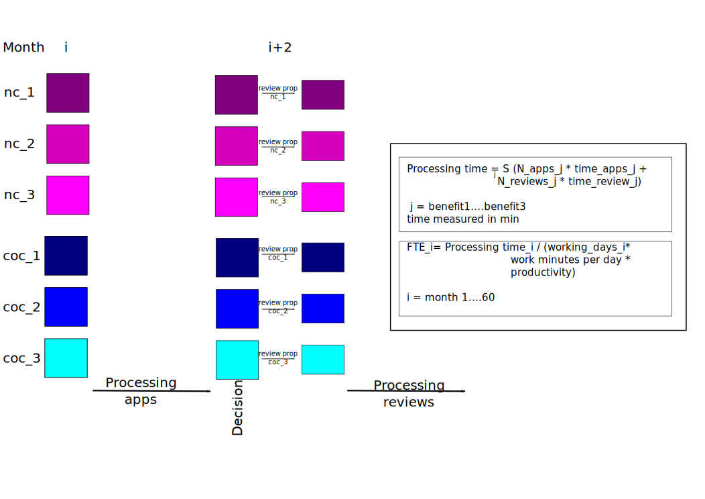

```{r setup, include=FALSE}
knitr::opts_chunk$set(echo = TRUE)

library(DT)
library(tidyverse)
```

# Background

-   Social Security Scotland administers three benefits. Applicants submit an application and 2 months later, receive a decision.
-   Applications can be of two types: new cases (nc) or change of circumstances (coc)
-   The data available is the forecasted number of applications for each of the type for each of the thee benefits
-   Clients receive the decision on their case 2 months after applying.
-   If unhappy with their decision, they request a review within that month.
-   SSS requires a forecast of FTE to process the nc and coc for initial applications and reviews

# Client Output requirements

-   A plot of the total FTE over time
-   A table with the annual FTE to process reviews and appeal defined as the median

# Assumptions

```{r Assumptions_review, echo=FALSE}

Benefits = c("Benefit1", "Benefit2", "Benefit3") 
Types = c('New Cases', 'Change of Circ'  )
review_prop <- dplyr::tibble(type = Types, 
                                       Benefit1 = c(0.1, 0.2), 
                                       Benefit2 = c(0.5, 0.65), 
                                       Benefit3 = c(0.2, 0.3)
                                       ) 
knitr::kable(review_prop, caption = "Proportion of total cases that require review" )
```

```{r Assumptions_app_times, echo = FALSE}
app_processing_time <- 
  dplyr::tibble(type = Types, 
                Benefit1 = c(20, 12), 
                Benefit2 = c(25, 12),
                Benefit3 = c(15, 10)
                )
knitr::kable(app_processing_time,
             caption = 
               "Time required to process applications (min)")
```

```{r Assumptions_review_times, echo = FALSE}
review_processing_time <-
  dplyr::tibble(type = Types, 
                Benefit1 = c(10, 10),
                Benefit2 = c(10, 12),
                Benefit3 = c(10, 15)
)
knitr::kable(review_processing_time, 
             caption = 
               "Time required to process reviews (min)")
```

-   The client has estimated that out of a `r 7.4*60` min day, a person is productive for 75% of the time

# Data

-   benefits_1.csv, benefits_2.csv, benefits_3.csv contain the forecasted number of applications of each type for the period of interest
-   working_days.csv contains the number of working days in each month over the period of interest


